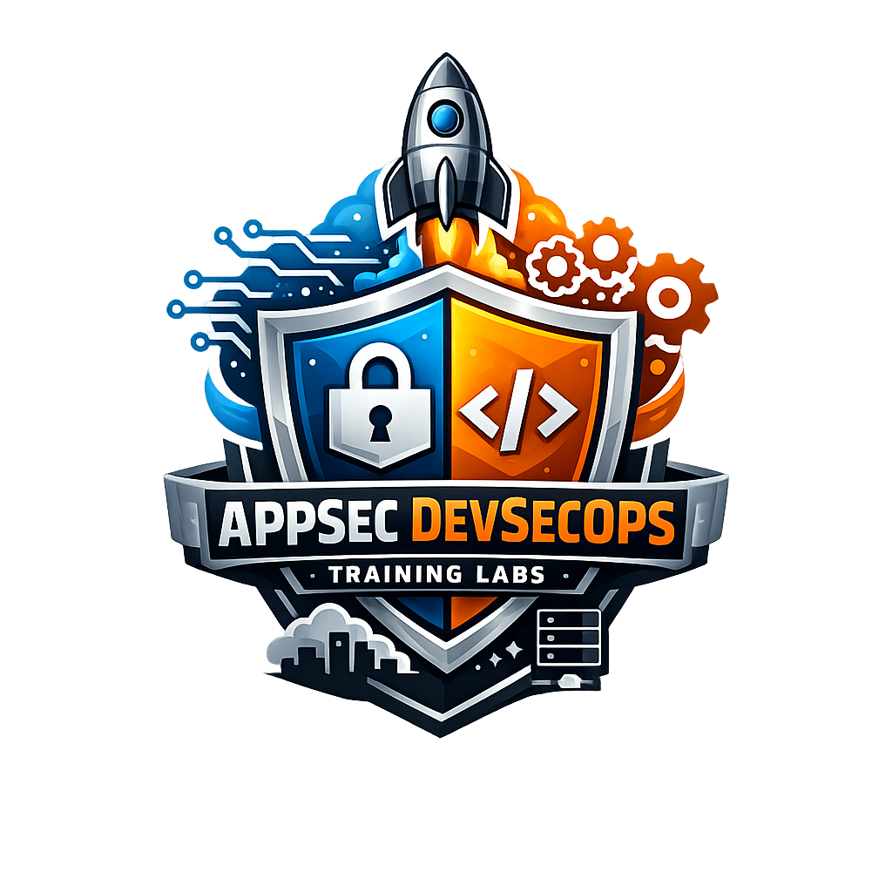

  

  <strong style="font-size: 2.1em;">AppSec & DevSecOps - Training Labs</strong>

 

# 🔐 Vulnerable Labs Catalog

> A professional catalog of deliberately vulnerable applications and environments for security training, testing, and tool validation.

This repository serves as a centralized index to help security professionals, developers, and researchers identify appropriate labs based on their training objectives.

> **⚠️ WARNING**: For educational purposes in isolated environments only. Do not deploy these applications in production or expose them to public networks.

## 📑 Table of Contents

* [📖 How to Use This Catalog](#-how-to-use-this-catalog)
* [🏷️ Training Focus Legend](#training-focus-legend)
* [🗂️ Labs by Category](#labs-by-category)
  * [🌐 Web Applications](#-web-applications) (14 labs)
  * [🔌 APIs](#-apis) (5 labs)
  * [📱 Mobile](#-mobile) (5 labs)
  * [☁️ Cloud Infrastructure](#cloud-infrastructure) (5 labs)
  * [🔄 CI/CD & Supply Chain](#-cicd--supply-chain) (7 labs)
  * [☸️ Kubernetes](#kubernetes) (2 labs)
  * [💻 Language-Specific & Code Review](#-language-specific--code-review) (8 labs)
  * [📚 Collections & Directories](#-collections--directories) (20 labs)
* [🛠️ Open Source Security Tools](#open-source-security-tools)
* [🎯 Training Paths](#-training-paths)
* [👥 Credits](#-credits)

---

## 📖 How to Use This Catalog

| Step | Action | Description |
| :--- | :--- | :--- |
| 1️⃣ | **Identify your training focus** | Review the Training Focus Legend to understand available training categories |
| 2️⃣ | **Browse by category** | Navigate to the relevant section (Web, API, Mobile, Cloud, etc.) to find labs matching your needs |
| 3️⃣ | **Review training focus tags** | Each lab includes tags indicating what security testing disciplines it supports |
| 4️⃣ | **Follow upstream documentation** | All installation, setup, and usage instructions are maintained in each project's original repository |
| 5️⃣ | **Use isolated environments** | Always run these labs in isolated, controlled environments. Never deploy to production |

💡 **Tip:** Click on any lab's upstream link to access detailed installation and usage documentation.

---

## 🏷️ Training Focus Legend

| Tag | Full Name | Description |
| :--- | :--- | :--- |
| **SAST** | Static Application Security Testing | Code analysis without executing the application |
| **SCA** | Software Composition Analysis | Dependency scanning and vulnerability detection |
| **DAST** | Dynamic Application Security Testing | Runtime security testing of running applications |
| **Pentest** | Penetration Testing | Manual security assessment and exploitation |
| **API Security** | API Security Testing | REST, GraphQL, SOAP, OpenAPI security testing |
| **Mobile Security** | Mobile Application Security | Android, iOS, and Hybrid app security |
| **Cloud Security** | Cloud Infrastructure Security | AWS, Azure, GCP security assessment |
| **Kubernetes** | Kubernetes Security | Container orchestration and K8s security |
| **CI/CD** | CI/CD Pipeline Security | Continuous Integration/Deployment security |
| **Supply Chain** | Supply Chain Security | Software supply chain vulnerability assessment |
| **Container** | Container Security | Docker and container image security |
| **IaC** | Infrastructure as Code | Terraform, CloudFormation security |
| **Secrets** | Secrets Management | Secret detection and management |
| **Auth** | Authentication & Authorization | Auth vulnerabilities and testing |
| **Injection** | Injection Vulnerabilities | SQL, NoSQL, Command injection testing |
| **SSRF** | Server-Side Request Forgery | SSRF vulnerability testing |
| **Secure Code Review** | Code Review | Manual code review and static analysis |
| **Threat Modeling** | Threat Modeling | Threat modeling exercises |

---

## 🗂️ Labs by Category

### 🌐 Web Applications

---

#### OWASP Juice Shop

> Modern web application with OWASP Top 10 vulnerabilities and beyond. Comprehensive training platform for web application security.

- **Training focus**: `DAST` `Pentest` `Injection` `Auth` `Secure Code Review`
- **Upstream**: [GitHub](https://github.com/juice-shop/juice-shop)

#### OWASP WebGoat

> Deliberately insecure web application maintained by OWASP for security training.

- **Training focus**: `DAST` `Pentest` `Injection` `Auth` `Secure Code Review`
- **Upstream**: [GitHub](https://github.com/madhuakula/WebGoat.NET)

#### OWASP Security Shepherd

> Web and mobile application security training platform with various vulnerability scenarios.

- **Training focus**: `DAST` `Pentest` `Secure Code Review` `Mobile Security`
- **Upstream**: [GitHub](https://github.com/markdenihan/www-project-security-shepherd)

#### Damn Vulnerable Web Application (DVWA)

> PHP/MySQL web application containing common web vulnerabilities for security training.

- **Training focus**: `DAST` `Pentest` `Injection` `Auth`
- **Upstream**: [GitHub](https://github.com/digininja/DVWA)

#### Damn Vulnerable NodeJS Application (DVNA)

> Vulnerable Node.js/Express application demonstrating common security issues in Node.js applications.

- **Training focus**: `SAST` `DAST` `Pentest` `Secure Code Review` `API Security`
- **Upstream**: [GitHub](https://github.com/appsecco/dvna)

#### Damn Vulnerable WordPress Site (DVWPS)

> WordPress installation with intentionally vulnerable plugins and themes.

- **Training focus**: `DAST` `Pentest` `SCA` `WordPress Security`
- **Upstream**: [GitHub](https://github.com/vianasw/dvwps)

#### Damn Vulnerable Web Services (DVWS) Node

> Node.js implementation of vulnerable web services for API security training.

- **Training focus**: `API Security` `DAST` `Pentest` `WebSockets`
- **Upstream**: [GitHub](https://github.com/snoopysecurity/dvws-node)

#### Tiredful API

> Intentionally vulnerable REST API designed for learning API security testing.

- **Training focus**: `API Security` `DAST` `Pentest` `REST`
- **Upstream**: [GitHub](https://github.com/payatu/Tiredful-API)

#### Application Vulnerable Log4Shell

> Application demonstrating the Log4Shell (CVE-2021-44228) vulnerability.

- **Training focus**: `SAST` `SCA` `Pentest` `Supply Chain` `Java`
- **Upstream**: [GitHub](https://github.com/christophetd/log4shell-vulnerable-app)

#### Application Vulnerable OTP

> Application with vulnerable One-Time Password (OTP) implementation.

- **Training focus**: `Auth` `Pentest` `Secure Code Review`
- **Upstream**: [GitHub](https://github.com/mddanish/Vulnerable-OTP-Application)

#### Vulnerable Web Application

> General-purpose vulnerable web application for security testing.

- **Training focus**: `DAST` `Pentest` `Secure Code Review`
- **Upstream**: [GitHub](https://github.com/fatihhcelik/Vulnerable-Web-Application)

#### Web Application Vulnerable ASP.NET Core 2.0

> ASP.NET Core application with security vulnerabilities.

- **Training focus**: `SAST` `DAST` `Pentest` `Secure Code Review` `.NET`
- **Upstream**: [GitHub](https://github.com/kmcquade/dvcsa)

#### VulnLab Web Application Vulnerability Lab Project

> Collection of web application vulnerabilities for training purposes.

- **Training focus**: `DAST` `Pentest` `Secure Code Review`
- **Upstream**: [GitHub](https://github.com/OWASP/OWASP-VWAD)

#### UnSAFE Bank Application

> Vulnerable banking application for web and mobile security training.

- **Training focus**: `DAST` `Pentest` `Auth` `Mobile Security` `Secure Code Review`
- **Upstream**: [GitHub](https://github.com/lucideus-repo/UnSAFE_Bank)

### 🔌 APIs

---

#### Damn Vulnerable GraphQL Application

> GraphQL API with intentionally introduced security vulnerabilities for training.

- **Training focus**: `API Security` `DAST` `Pentest` `GraphQL`
- **Upstream**: [GitHub](https://github.com/dolevf/Damn-Vulnerable-GraphQL-Application)

#### VAmPI

> Vulnerable REST API designed for learning API security testing techniques.

- **Training focus**: `API Security` `DAST` `Pentest` `REST`
- **Upstream**: [GitHub](https://github.com/erev0s/VAmPI)

#### OpenAPI 3 The Vulnerable API

> API demonstrating OpenAPI security issues and misconfigurations.

- **Training focus**: `API Security` `DAST` `Pentest` `OpenAPI`
- **Upstream**: [GitHub](https://github.com/mattvaldes/vulnerable-api)

#### VyAPI - Vulnerable Hybrid Android App

> Cloud-based vulnerable hybrid Android application with API security issues.

- **Training focus**: `API Security` `Mobile Security` `DAST` `Pentest`
- **Upstream**: [GitHub](https://github.com/appsecco/VyAPI)

#### Damn Vulnerable C# API

> C# API with security vulnerabilities for training.

- **Training focus**: `API Security` `SAST` `DAST` `Pentest` `.NET` `Secure Code Review`
- **Upstream**: [GitHub](https://github.com/appsecco/dvcsharp-api)

### 📱 Mobile

---

#### Damn Vulnerable iOS App (DVIA)

> iOS application with security vulnerabilities for mobile security training.

- **Training focus**: `Mobile Security` `SAST` `Pentest` `iOS` `Secure Code Review`
- **Upstream**: [GitHub](https://github.com/prateek147/DVIA)

#### Damn Vulnerable iOS App v2 (DVIA-v2)

> Updated version of DVIA with additional iOS security vulnerabilities.

- **Training focus**: `Mobile Security` `SAST` `Pentest` `iOS` `Secure Code Review`
- **Upstream**: [GitHub](https://github.com/prateek147/DVIA-v2)

#### Oversecured Vulnerable Android App

> Android application with security vulnerabilities for mobile security testing.

- **Training focus**: `Mobile Security` `SAST` `Pentest` `Android` `Secure Code Review`
- **Upstream**: [GitHub](https://github.com/oversecured/oversecured-android-gradle)

#### Oversecured Vulnerable iOS App

> iOS application with security vulnerabilities for mobile security testing.

- **Training focus**: `Mobile Security` `SAST` `Pentest` `iOS` `Secure Code Review`
- **Upstream**: [GitHub](https://github.com/oversecured/OversecuredVulnerableiOSApp)

#### Vulnerable Android Application

> Android application with security vulnerabilities for training.

- **Training focus**: `Mobile Security` `SAST` `Pentest` `Android` `Secure Code Review`
- **Upstream**: [GitHub](https://github.com/ashishb/android-security-awesome)

### ☁️ Cloud Infrastructure

---

#### AWSGoat

> Deliberately vulnerable AWS infrastructure for cloud security training and attack simulation.

- **Training focus**: `Cloud Security` `IaC` `Pentest` `AWS`
- **Upstream**: [GitHub](https://github.com/jeswinMathai/AWSGoat)

#### AWSGoat - A Damn Vulnerable AWS Infrastructure

> Alternative AWSGoat implementation with vulnerable AWS infrastructure scenarios.

- **Training focus**: `Cloud Security` `IaC` `Pentest` `AWS`
- **Upstream**: [GitHub](https://github.com/SSKale1/AWSGoat)

#### AzureGoat

> Deliberately vulnerable Azure infrastructure for cloud security training.

- **Training focus**: `Cloud Security` `IaC` `Pentest` `Azure`
- **Upstream**: [GitHub](https://github.com/jeswinMathai/AzureGoat)

#### GCP Goat

> Deliberately vulnerable GCP infrastructure for cloud security training.

- **Training focus**: `Cloud Security` `IaC` `Pentest` `GCP`
- **Upstream**: [GitHub](https://github.com/JOSHUAJEBARAJ/GCP-Goat)

#### Damn Vulnerable Cloud Application (DVCA)

> Cloud-native application with security vulnerabilities across multiple cloud services.

- **Training focus**: `Cloud Security` `Container` `IaC` `Pentest`
- **Upstream**: [GitHub](https://github.com/m6a-UdS/dvca)

### 🔄 CI/CD & Supply Chain

---

#### CI/CD Goat

> Deliberately vulnerable CI/CD environment with multiple pipeline scenarios (GitLab, Jenkins, GitHub Actions).

- **Training focus**: `CI/CD` `Supply Chain` `Pentest` `IaC`
- **Upstream**: [GitHub](https://github.com/cider-security-research/cicd-goat)

#### GitHub Actions Goat

> Vulnerable GitHub Actions workflows for CI/CD security testing.

- **Training focus**: `CI/CD` `Supply Chain` `GitHub Actions` `Secrets`
- **Upstream**: [GitHub](https://github.com/step-security/github-actions-goat)

#### DevSecOps Lab

> DevSecOps lab with GitLab CE setup and pipeline security practices.

- **Training focus**: `CI/CD` `DevSecOps` `GitLab CI` `Supply Chain`
- **Upstream**: [GitHub](https://github.com/Cloufish/DevSecOps-Lab)

#### Azure DevOps Labs

> Azure DevOps labs with pipeline security scenarios and best practices.

- **Training focus**: `CI/CD` `Azure DevOps` `Supply Chain` `IaC`
- **Upstream**: [GitHub](https://github.com/microsoft/azuredevopslabs)

#### Implement Security Through Pipeline Using DevOps

> Microsoft Learning lab for Azure DevOps pipeline security implementation.

- **Training focus**: `CI/CD` `Azure DevOps` `Supply Chain` `Secure Code Review`
- **Upstream**: [GitHub](https://github.com/MicrosoftLearning/implement-security-through-pipeline-using-devops)

#### RailsGoat CI/CD Lab

> RailsGoat application with CI/CD security scenarios.

- **Training focus**: `CI/CD` `Supply Chain` `Ruby` `Secure Code Review`
- **Upstream**: [GitHub](https://github.com/dachiefjustice/railsgoat-cicd-lab)

#### Applying DevSecOps to Juice Shop

> DevSecOps pipeline integration example with OWASP Juice Shop.

- **Training focus**: `CI/CD` `DevSecOps` `Supply Chain` `DAST`
- **Upstream**: [GitLab](https://gitlab.com/devsecops8471116/applying-dev-sec-ops-to-juice-shop)

### ☸️ Kubernetes

---

#### Kubernetes Goat

> Vulnerable Kubernetes cluster designed for learning Kubernetes security.

- **Training focus**: `Kubernetes` `Container` `Cloud Security` `Pentest` `IaC`
- **Upstream**: [GitHub](https://github.com/madhuakula/kubernetes-goat)

#### OWASP EKS Goat

> Vulnerable AWS EKS cluster for Kubernetes security training.

- **Training focus**: `Kubernetes` `Cloud Security` `AWS` `Container` `Pentest`
- **Upstream**: [GitHub](https://github.com/OWASP/www-project-eks-goat)

### 💻 Language-Specific & Code Review

---

#### Damn Vulnerable Java Application (DVJA)

> Java web application with security vulnerabilities for code review and SAST training.

- **Training focus**: `SAST` `Secure Code Review` `Java` `Injection` `Auth`
- **Upstream**: [GitHub](https://github.com/appsecco/dvja)

#### Damn Vulnerable Python Web Application (DVPWA)

> Python web application with security vulnerabilities for code review training.

- **Training focus**: `SAST` `Secure Code Review` `Python` `Injection` `Auth`
- **Upstream**: [GitHub](https://github.com/anxolerd/dvpwa)

#### Damn Vulnerable Ruby on Rails (DVRA)

> Ruby on Rails application with security vulnerabilities for code review.

- **Training focus**: `SAST` `Secure Code Review` `Ruby` `Injection` `Auth`
- **Upstream**: [GitHub](https://github.com/guilleiguaran/dvra)

#### Application Java Spring Vulny

> Java Spring application with security vulnerabilities.

- **Training focus**: `SAST` `Secure Code Review` `Java` `Spring` `Injection`
- **Upstream**: [GitHub](https://github.com/kaakaww/javaspringvulny)

#### Java Application Vulnerable Lab

> Java application with security vulnerabilities for training.

- **Training focus**: `SAST` `Secure Code Review` `Java` `Injection`
- **Upstream**: [GitHub](https://github.com/CSPF-Founder/JavaVulnerableLab)

#### Goof - Snyk's Vulnerable Demo Application

> Vulnerable application for demonstrating SCA and dependency scanning tools.

- **Training focus**: `SCA` `SAST` `Secure Code Review` `Supply Chain`
- **Upstream**: [GitHub](https://github.com/snyk-labs/nodejs-goof)

#### Vulnerable Languages

> Collection of vulnerable code examples across multiple programming languages.

- **Training focus**: `SAST` `Secure Code Review` `Multi-language`
- **Upstream**: [GitHub](https://github.com/arall/vulnerabilities)

#### Certified Red Team Python Analyst (CRPYA)

> Python-based vulnerable application for red team training and code review.

- **Training focus**: `SAST` `Secure Code Review` `Python` `Pentest`
- **Upstream**: [GitHub](https://github.com/CyberSecurityUP/CRPYA)

### 📚 Collections & Directories

---

#### Vulhub

> Collection of pre-built vulnerable Docker environments for various CVEs and security issues.

- **Training focus**: `DAST` `Pentest` `Container` `Multi-vulnerability`
- **Upstream**: [GitHub](https://github.com/vulhub/vulhub)

#### Damn Vulnerable Web Services (DVWS)

> PHP-based vulnerable web services for API and web security training.

- **Training focus**: `API Security` `DAST` `Pentest` `WebSockets`
- **Upstream**: [GitHub](https://github.com/snoopysecurity/dvws)

#### Damn Vulnerable Bank

> Banking application with security vulnerabilities for financial application security training.

- **Training focus**: `DAST` `Pentest` `Auth` `Secure Code Review`
- **Upstream**: [GitHub](https://github.com/rewanthtammana/Damn-Vulnerable-Bank)

#### Damn Vulnerable Serverless Application (DVSA)

> Serverless application with security vulnerabilities for cloud and serverless security training.

- **Training focus**: `Cloud Security` `Serverless` `DAST` `Pentest` `IaC`
- **Upstream**: [GitHub](https://github.com/OWASP/DVSA)

#### Damn Vulnerable Thick Client Application (DVTA)

> Thick client application with security vulnerabilities for desktop application security training.

- **Training focus**: `SAST` `Pentest` `Secure Code Review` `Client-Side Security`
- **Upstream**: [GitHub](https://github.com/srini0x00/dvta)

#### Damn Vulnerable IoT Device (DVID)

> IoT device firmware with security vulnerabilities for embedded systems security training.

- **Training focus**: `SAST` `Pentest` `Firmware Security` `Embedded Systems`
- **Upstream**: [GitHub](https://github.com/Vulcainreo/DVID)

#### Damn Vulnerable Router Firmware (DVRF)

> Router firmware with security vulnerabilities for embedded and network device security training.

- **Training focus**: `SAST` `Pentest` `Firmware Security` `Embedded Systems`
- **Upstream**: [GitHub](https://github.com/praetorian-inc/DVRF)

#### Damn Vulnerable Micro Services (DVMS)

> Microservices architecture with security vulnerabilities for distributed systems security training.

- **Training focus**: `API Security` `Microservices` `DAST` `Pentest` `Container`
- **Upstream**: [GitHub](https://github.com/ne0z/DamnVulnerableMicroServices)

#### Damn Vulnerable Grade Management (DVGM)

> Grade management system with security vulnerabilities.

- **Training focus**: `DAST` `Pentest` `Secure Code Review`
- **Upstream**: [GitLab](https://git.logicalhacking.com/BrowserSecurity/DVGM)

#### Application Vulnerable Lab SSRF

> Application specifically designed to demonstrate SSRF vulnerabilities.

- **Training focus**: `SSRF` `DAST` `Pentest` `Secure Code Review`
- **Upstream**: [GitHub](https://github.com/incredibleindishell/SSRF_Vulnerable_Lab)

#### CORS Misconfiguration Vulnerable Lab

> Application demonstrating CORS misconfiguration vulnerabilities.

- **Training focus**: `DAST` `Pentest` `Auth` `CORS`
- **Upstream**: [GitHub](https://github.com/incredibleindishell/CORS-vulnerable-Lab)

#### Application Authentication Vulnerable Lab

> Application with authentication and authorization vulnerabilities.

- **Training focus**: `Auth` `DAST` `Pentest` `Secure Code Review`
- **Upstream**: [GitHub](https://github.com/digininja/authlab)

#### Application Docker Vulnerable

> Docker containerized application with security vulnerabilities.

- **Training focus**: `Container` `DAST` `Pentest` `Secure Code Review`
- **Upstream**: [GitHub](https://github.com/OWASP/vulnerable-container-hub)

#### Template Injection Workshop

> Application demonstrating template injection vulnerabilities (SSTI).

- **Training focus**: `Injection` `DAST` `Pentest` `Secure Code Review`
- **Upstream**: [GitHub](https://github.com/GoSecure/template-injection-workshop)

#### Application Broken Crystals

> Application with various security vulnerabilities for training.

- **Training focus**: `DAST` `Pentest` `Secure Code Review`
- **Upstream**: [GitHub](https://github.com/derevnjuk/sectester-js-demo-broken-crystals)

#### OWASP Vulnerable App

> OWASP-maintained vulnerable application for security training.

- **Training focus**: `DAST` `Pentest` `Secure Code Review`
- **Upstream**: [GitHub](https://github.com/SasanLabs/VulnerableApp)

#### Public Pentesting Reports

> Collection of public penetration testing reports for learning and reference.

- **Training focus**: `Pentest` `Threat Modeling` `Security Assessment`
- **Upstream**: [GitHub](https://github.com/juliocesarfort/public-pentesting-reports)

#### OWASP Vulnerable Web Applications Directory Project

> Directory and index of vulnerable web applications for security training.

- **Training focus**: `Reference` `Directory` `Multi-vulnerability`
- **Upstream**: [GitHub](https://github.com/OWASP/www-project-vulnerable-web-applications-directory)

#### Vulnerable Client Server Application (VuCSA)

> Client-server application with security vulnerabilities.

- **Training focus**: `SAST` `DAST` `Pentest` `Secure Code Review` `Network Security`
- **Upstream**: [GitHub](https://github.com/Warxim/vucsa)

#### SQLite Lab

> Application demonstrating SQLite database security issues.

- **Training focus**: `Injection` `DAST` `Pentest` `Database Security`
- **Upstream**: [GitHub](https://github.com/incredibleindishell/sqlite-lab)

## 🛠️ Open Source Security Tools

> This section lists recommended open source security tools for testing and analyzing the vulnerable labs in this catalog. All tools listed are open source and freely available.

---

### Static Application Security Testing (SAST)

#### SonarQube

> Continuous inspection of code quality and security vulnerabilities across multiple programming languages.

- **Use cases**: Code review, vulnerability detection, code quality analysis
- **Repository**: [GitHub](https://github.com/SonarSource/sonarqube)
- **Website**: [sonarqube.org](https://www.sonarqube.org/)

#### Semgrep

> Fast, open source static analysis tool for finding bugs and enforcing code standards.

- **Use cases**: SAST, security rule enforcement, CI/CD integration
- **Repository**: [GitHub](https://github.com/semgrep/semgrep)
- **Website**: [semgrep.dev](https://semgrep.dev/)

#### Bandit

> Security linter for Python code, designed to find common security issues.

- **Use cases**: Python SAST, security code review
- **Repository**: [GitHub](https://github.com/PyCQA/bandit)
- **Website**: [bandit.readthedocs.io](https://bandit.readthedocs.io/)

#### Brakeman

> Static analysis security scanner for Ruby on Rails applications.

- **Use cases**: Ruby/Rails SAST, vulnerability detection
- **Repository**: [GitHub](https://github.com/presidentbeef/brakeman)
- **Website**: [brakemanscanner.org](https://brakemanscanner.org/)

#### ESLint Security Plugin

> ESLint plugin for identifying security vulnerabilities in JavaScript/TypeScript code.

- **Use cases**: JavaScript/TypeScript SAST, Node.js security
- **Repository**: [GitHub](https://github.com/nodesecurity/eslint-plugin-security)

### Dynamic Application Security Testing (DAST)

#### OWASP ZAP
- **Description**: Open source web application security scanner for finding vulnerabilities in web applications.
- **Use cases**: DAST, automated security testing, API security testing
- **Repository**: [GitHub](https://github.com/zaproxy/zaproxy)
- **Website**: [owasp.org/www-project-zap](https://owasp.org/www-project-zap/)

#### Burp Suite Community Edition

> Free edition of Burp Suite for web application security testing and manual penetration testing.

- **Use cases**: Manual pentesting, web application security, API testing
- **Website**: [portswigger.net/burp/communitydownload](https://portswigger.net/burp/communitydownload)

#### Nikto
- **Description**: Web server scanner that performs comprehensive tests against web servers for multiple items.
- **Use cases**: Web server scanning, vulnerability detection
- **Repository**: [GitHub](https://github.com/sullo/nikto)
- **Website**: [cirt.net/Nikto2](https://cirt.net/Nikto2)

#### Wfuzz

> Web application fuzzer for discovering vulnerabilities in web applications.

- **Use cases**: Web fuzzing, parameter discovery, brute forcing
- **Repository**: [GitHub](https://github.com/xmendez/wfuzz)
- **Website**: [wfuzz.readthedocs.io](https://wfuzz.readthedocs.io/)

### Software Composition Analysis (SCA)

#### OWASP Dependency-Check

> Detects publicly disclosed vulnerabilities in application dependencies.

- **Use cases**: Dependency scanning, CVE detection, supply chain security
- **Repository**: [GitHub](https://github.com/jeremylong/DependencyCheck)
- **Website**: [owasp.org/www-project-dependency-check](https://owasp.org/www-project-dependency-check/)

#### Snyk Open Source

> Open source security scanner for finding and fixing vulnerabilities in dependencies.

- **Use cases**: SCA, dependency vulnerability scanning, license compliance
- **Repository**: [GitHub](https://github.com/snyk/snyk)
- **Website**: [snyk.io](https://snyk.io/)

#### Dependabot

> Automated dependency update tool that creates pull requests to keep dependencies secure and up-to-date.

- **Use cases**: Automated dependency updates, security alerts
- **Repository**: [GitHub](https://github.com/dependabot/dependabot-core)
- **Website**: [docs.github.com/dependabot](https://docs.github.com/dependabot)

### Container Security

#### Trivy

> Comprehensive security scanner for containers, file systems, and Git repositories.

- **Use cases**: Container scanning, vulnerability detection, IaC scanning
- **Repository**: [GitHub](https://github.com/aquasecurity/trivy)
- **Website**: [aquasecurity.github.io/trivy](https://aquasecurity.github.io/trivy/)

#### Clair

> Vulnerability static analysis for containers and application container images.

- **Use cases**: Container image scanning, CVE detection
- **Repository**: [GitHub](https://github.com/quay/clair)
- **Website**: [quay.github.io/clair](https://quay.github.io/clair/)

#### Docker Bench Security

> Script that checks for common best practices around deploying Docker containers in production.

- **Use cases**: Docker security auditing, container hardening
- **Repository**: [GitHub](https://github.com/docker/docker-bench-security)

### Kubernetes Security

#### kube-bench
- **Description**: Checks whether Kubernetes is deployed securely by running checks documented in the CIS Kubernetes Benchmark.
- **Use cases**: Kubernetes security auditing, compliance checking
- **Repository**: [GitHub](https://github.com/aquasecurity/kube-bench)
- **Website**: [aquasecurity.github.io/kube-bench](https://aquasecurity.github.io/kube-bench/)

#### kube-hunter

> Penetration testing tool for Kubernetes clusters that discovers security weaknesses.

- **Use cases**: Kubernetes pentesting, security assessment
- **Repository**: [GitHub](https://github.com/aquasecurity/kube-hunter)
- **Website**: [aquasecurity.github.io/kube-hunter](https://aquasecurity.github.io/kube-hunter/)

#### Polaris

> Kubernetes configuration validation and best practices checking.

- **Use cases**: Kubernetes configuration security, best practices enforcement
- **Repository**: [GitHub](https://github.com/FairwindsOps/polaris)
- **Website**: [polaris.docs.fairwinds.com](https://polaris.docs.fairwinds.com/)

#### Falco

> Cloud-native runtime security project that detects anomalous activity and threats.

- **Use cases**: Runtime security, threat detection, Kubernetes security monitoring
- **Repository**: [GitHub](https://github.com/falcosecurity/falco)
- **Website**: [falco.org](https://falco.org/)

### Infrastructure as Code (IaC) Security

#### Checkov

> Static code analysis tool for infrastructure as code (Terraform, CloudFormation, Kubernetes, etc.).

- **Use cases**: IaC security scanning, misconfiguration detection
- **Repository**: [GitHub](https://github.com/bridgecrewio/checkov)
- **Website**: [checkov.io](https://www.checkov.io/)

#### Terrascan

> Static code analyzer for Infrastructure as Code to detect security and compliance violations.

- **Use cases**: Terraform security, IaC compliance, cloud security
- **Repository**: [GitHub](https://github.com/tenable/terrascan)
- **Website**: [runterrascan.io](https://runterrascan.io/)

#### TFLint

> Terraform linter that finds errors and best practices issues in Terraform code.

- **Use cases**: Terraform linting, best practices enforcement
- **Repository**: [GitHub](https://github.com/terraform-linters/tflint)
- **Website**: [github.com/terraform-linters/tflint](https://github.com/terraform-linters/tflint)

### Secrets Detection

#### TruffleHog

> Detects secrets, credentials, and other sensitive data in code repositories.

- **Use cases**: Secret scanning, credential detection, Git history scanning
- **Repository**: [GitHub](https://github.com/trufflesecurity/trufflehog)
- **Website**: [trufflesecurity.com](https://trufflesecurity.com/)

#### GitLeaks

> Fast and easy-to-use tool for detecting hardcoded secrets in Git repositories.

- **Use cases**: Secret detection, credential scanning, Git security
- **Repository**: [GitHub](https://github.com/gitleaks/gitleaks)
- **Website**: [gitleaks.io](https://gitleaks.io/)

#### detect-secrets

> Tool for detecting secrets in codebases and preventing them from being committed.

- **Use cases**: Pre-commit hooks, secret prevention, credential detection
- **Repository**: [GitHub](https://github.com/Yelp/detect-secrets)
- **Website**: [github.com/Yelp/detect-secrets](https://github.com/Yelp/detect-secrets)

### API Security Testing

#### Postman

> API platform for building and testing APIs (free tier available).

- **Use cases**: API testing, API security testing, API documentation
- **Repository**: [GitHub](https://github.com/postmanlabs/postman-app-support)
- **Website**: [postman.com](https://www.postman.com/)

#### Insomnia

> Open source API client for GraphQL, REST, and gRPC.

- **Use cases**: API testing, API debugging, API security testing
- **Repository**: [GitHub](https://github.com/Kong/insomnia)
- **Website**: [insomnia.rest](https://insomnia.rest/)

#### REST Assured

> Java DSL for easy testing of REST services.

- **Use cases**: API testing, REST API automation, Java API testing
- **Repository**: [GitHub](https://github.com/rest-assured/rest-assured)
- **Website**: [rest-assured.io](https://rest-assured.io/)

### Mobile Security

#### Mobile Security Framework (MobSF)

> Automated mobile application security testing framework for Android and iOS.

- **Use cases**: Mobile app security testing, static and dynamic analysis
- **Repository**: [GitHub](https://github.com/MobSF/Mobile-Security-Framework-MobSF)
- **Website**: [mobsf.github.io](https://mobsf.github.io/)

#### QARK

> Tool designed to look for security issues in Android applications.

- **Use cases**: Android security analysis, vulnerability detection
- **Repository**: [GitHub](https://github.com/linkedin/qark)
- **Website**: [github.com/linkedin/qark](https://github.com/linkedin/qark)

#### Frida

> Dynamic instrumentation toolkit for reverse engineering and security research.

- **Use cases**: Mobile app reverse engineering, dynamic analysis, runtime manipulation
- **Repository**: [GitHub](https://github.com/frida/frida)
- **Website**: [frida.re](https://frida.re/)

### Cloud Security

#### Scout Suite

> Multi-cloud security auditing tool for security posture assessment.

- **Use cases**: Cloud security auditing, AWS/Azure/GCP security assessment
- **Repository**: [GitHub](https://github.com/nccgroup/ScoutSuite)
- **Website**: [github.com/nccgroup/ScoutSuite](https://github.com/nccgroup/ScoutSuite)

#### Prowler

> AWS security assessment tool based on AWS security best practices.

- **Use cases**: AWS security auditing, compliance checking, security assessment
- **Repository**: [GitHub](https://github.com/prowler-cloud/prowler)
- **Website**: [prowler.pro](https://prowler.pro/)

#### CloudSploit

> Open source security scanning tool for cloud infrastructure (AWS, Azure, GCP).

- **Use cases**: Cloud security scanning, misconfiguration detection
- **Repository**: [GitHub](https://github.com/aquasecurity/cloudsploit)
- **Website**: [cloudsploit.com](https://cloudsploit.com/)

### CI/CD Security

#### GitLab CI/CD

> Built-in CI/CD platform with security scanning capabilities (open source edition available).

- **Use cases**: CI/CD pipelines, automated security scanning, DevSecOps
- **Repository**: [GitHub](https://github.com/gitlabhq/gitlabhq)
- **Website**: [gitlab.com](https://gitlab.com/)

#### GitHub Actions

> CI/CD platform with security workflows and scanning capabilities (free for public repos).

- **Use cases**: CI/CD automation, security scanning, workflow automation
- **Documentation**: [docs.github.com/actions](https://docs.github.com/actions)

#### Jenkins
- **Description**: Open source automation server with extensive plugin ecosystem for security scanning.
- **Use cases**: CI/CD pipelines, security integration, automation
- **Repository**: [GitHub](https://github.com/jenkinsci/jenkins)
- **Website**: [jenkins.io](https://www.jenkins.io/)

### General Security Testing

#### Metasploit Framework

> Penetration testing framework for developing and executing exploit code.

- **Use cases**: Penetration testing, exploit development, security research
- **Repository**: [GitHub](https://github.com/rapid7/metasploit-framework)
- **Website**: [metasploit.com](https://www.metasploit.com/)

#### Nmap

> Network discovery and security auditing tool.

- **Use cases**: Network scanning, port scanning, service detection
- **Repository**: [GitHub](https://github.com/nmap/nmap)
- **Website**: [nmap.org](https://nmap.org/)

#### SQLMap

> Automated SQL injection and database takeover tool.

- **Use cases**: SQL injection testing, database security assessment
- **Repository**: [GitHub](https://github.com/sqlmapproject/sqlmap)
- **Website**: [sqlmap.org](https://sqlmap.org/)

## 🎯 Training Paths

Select a training path based on your security testing objectives. Each path includes 6 recommended labs to build comprehensive skills in that domain.

### 🔍 SAST/SCA Path

**Focus**: Static analysis and dependency scanning training

| # | Lab | Focus Area |
|---|-----|------------|
| 1 | **Damn Vulnerable Java Application (DVJA)** | Java SAST and code review |
| 2 | **Damn Vulnerable Python Web Application (DVPWA)** | Python SAST and code review |
| 3 | **Goof - Snyk's Vulnerable Demo Application** | SCA and dependency scanning |
| 4 | **Vulnerable Languages** | Multi-language SAST training |
| 5 | **Application Vulnerable Log4Shell** | SCA and supply chain security |
| 6 | **Application Java Spring Vulny** | Java Spring SAST and code review |

### 🎯 DAST/Pentest Path

**Focus**: Dynamic testing and penetration testing

| # | Lab | Focus Area |
|---|-----|------------|
| 1 | **OWASP Juice Shop** | Comprehensive web application pentesting |
| 2 | **Damn Vulnerable Web Application (DVWA)** | Classic web pentesting |
| 3 | **OWASP WebGoat** | Structured pentesting training |
| 4 | **Vulhub** | CVE-specific vulnerability testing |
| 5 | **OWASP Security Shepherd** | Guided pentesting scenarios |
| 6 | **Damn Vulnerable Bank** | Financial application pentesting |

### 🔌 API Security Path

**Focus**: API security testing

| # | Lab | Focus Area |
|---|-----|------------|
| 1 | **Damn Vulnerable GraphQL Application** | GraphQL API security |
| 2 | **VAmPI** | REST API security testing |
| 3 | **Tiredful API** | REST API pentesting |
| 4 | **OpenAPI 3 The Vulnerable API** | OpenAPI security issues |
| 5 | **Damn Vulnerable Web Services (DVWS)** | Web services security |
| 6 | **Damn Vulnerable C# API** | C# API security testing |

### 📱 Mobile Security Path

**Focus**: Mobile application security

| # | Lab | Focus Area |
|---|-----|------------|
| 1 | **Damn Vulnerable iOS App (DVIA)** | iOS security testing |
| 2 | **Damn Vulnerable iOS App v2 (DVIA-v2)** | iOS security testing (updated) |
| 3 | **Oversecured Vulnerable Android App** | Android security testing |
| 4 | **Oversecured Vulnerable iOS App** | iOS pentesting |
| 5 | **Vulnerable Android Application** | Android code review |
| 6 | **Damn Vulnerable Hybrid Mobile App (DVHMA)** | Hybrid app security |

### ☁️ Cloud/K8s/CI-CD Path

**Focus**: Cloud, Kubernetes, and CI/CD security

| # | Lab | Focus Area |
|---|-----|------------|
| 1 | **AWSGoat** | AWS cloud security |
| 2 | **Kubernetes Goat** | Kubernetes security |
| 3 | **CI/CD Goat** | CI/CD pipeline security |
| 4 | **GitHub Actions Goat** | GitHub Actions security |
| 5 | **OWASP EKS Goat** | AWS EKS security |
| 6 | **Damn Vulnerable Cloud Application (DVCA)** | Multi-cloud security |

## 👥 Credits

All labs are maintained by their respective authors and organizations. This catalog serves as a centralized index. For detailed information, licensing, and contributions, please refer to each lab's original repository.

### 📦 Lab Sources

Labs are sourced from various organizations and individual contributors, including:

- **OWASP projects** - Industry-leading security community
- **Individual security researchers and developers** - Community contributors
- **Educational institutions** - Academic security programs
- **Security training organizations** - Professional training providers

### 🛠️ Catalog Maintainer

This catalog is maintained as a community resource for security education and training purposes.

---

**⚠️ Disclaimer**

This repository is for **educational purposes only**. The vulnerable applications contained herein should only be used in **isolated, controlled environments**. The maintainers are not responsible for any misuse of these resources.

